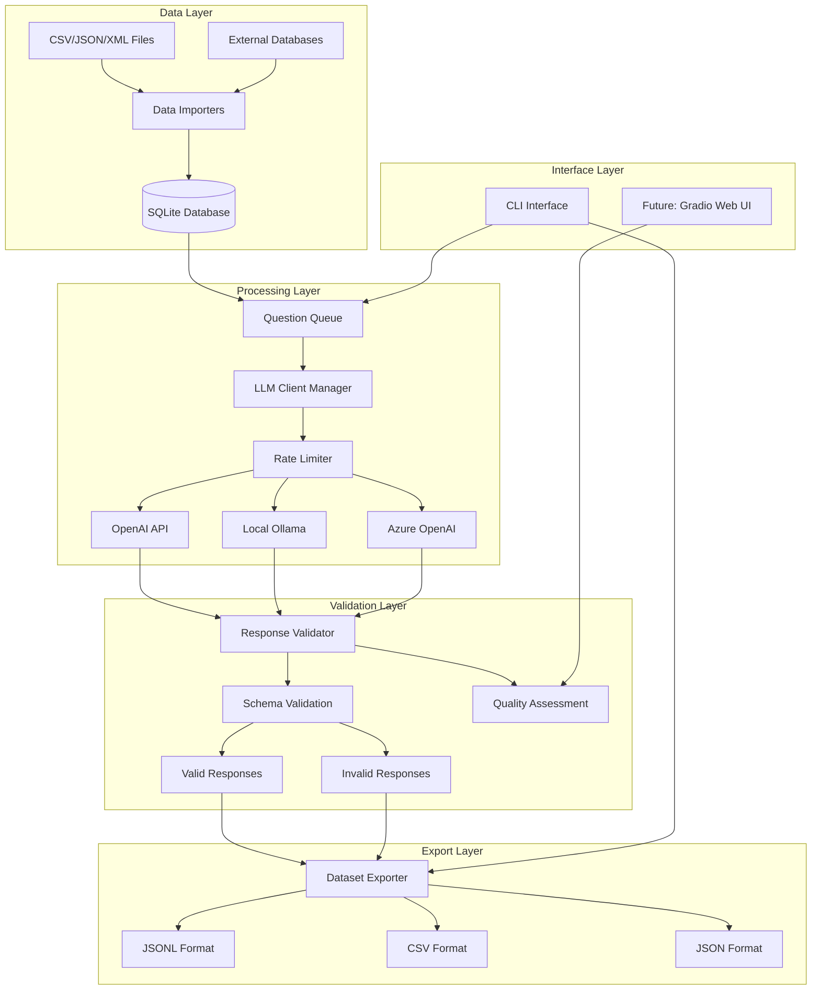
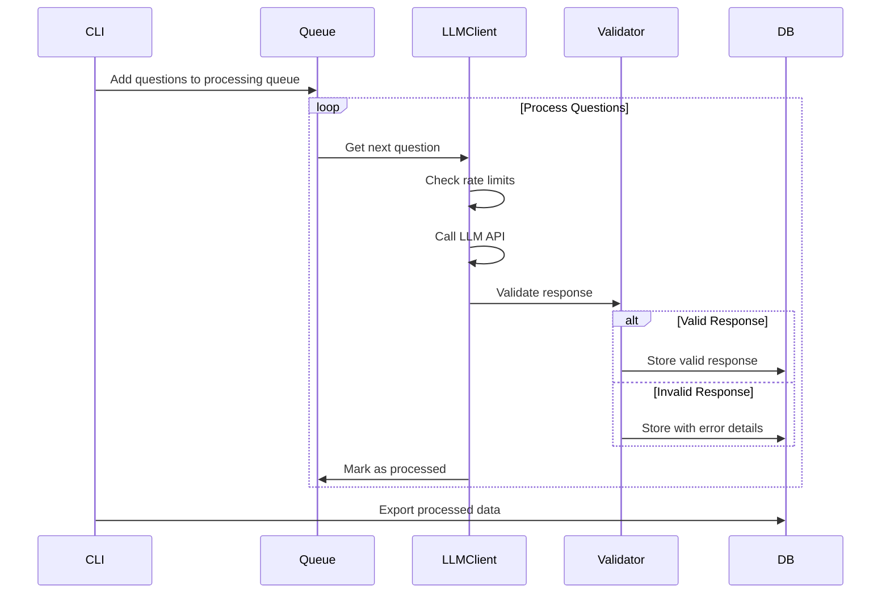
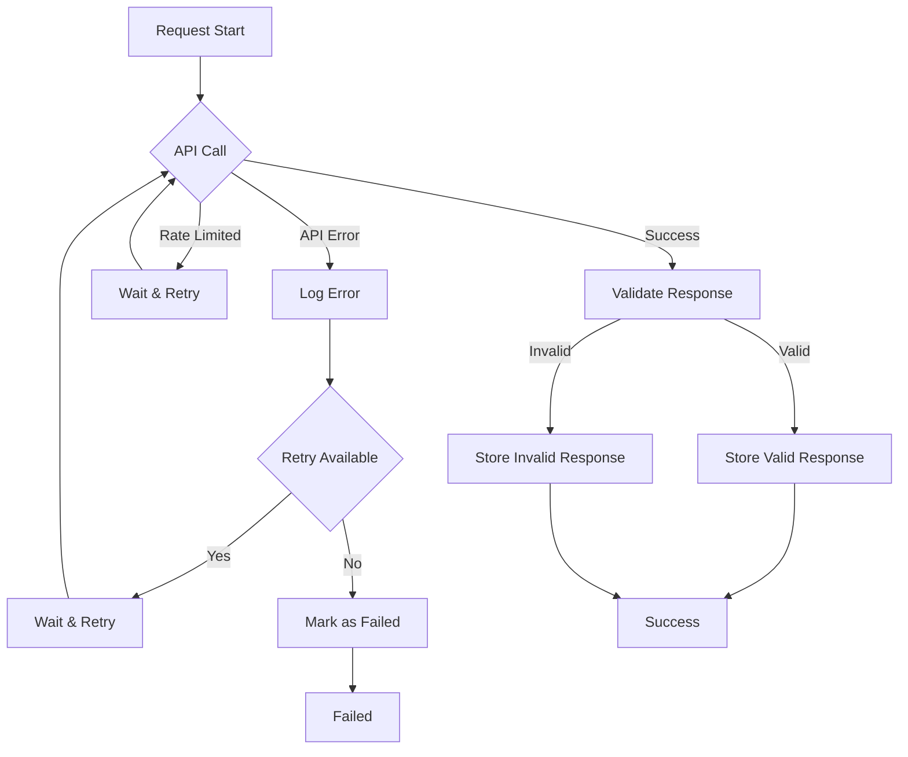

# System Architecture

## 🏗️ High-Level Architecture

De LLM Distiller volgt een modulaire, event-gedreven architectuur die schaalbaarheid en flexibiliteit mogelijk maakt.



## 📦 Component Architecture

### 1. Data Import Layer

#### Import Manager
```python
class ImportManager:
    """Central coordinator for all data import operations"""
    
    def __init__(self):
        self.importers = {
            'csv': CSVImporter(),
            'json': JSONImporter(),
            'xml': XMLImporter(),
            'database': DatabaseImporter()
        }
    
    async def import_data(self, source_type: str, config: ImportConfig):
        """Route import request to appropriate importer"""
```

#### Importer Interface
```python
class BaseImporter(ABC):
    """Abstract base class for all data importers"""
    
    @abstractmethod
    async def validate_source(self, source: str) -> bool:
        """Validate if source is accessible and valid"""
    
    @abstractmethod
    async def extract_data(self, source: str) -> List[QuestionData]:
        """Extract and normalize data from source"""
    
    @abstractmethod
    async def store_data(self, data: List[QuestionData]) -> ImportResult:
        """Store extracted data in database"""
```

### 2. Database Layer

#### Connection Management
```python
class DatabaseManager:
    """Central database connection and session management"""
    
    def __init__(self, config: DatabaseConfig):
        self.engine = create_engine(config.url, echo=config.echo)
        self.SessionLocal = sessionmaker(bind=self.engine)
    
    def get_session(self) -> Session:
        """Get database session with proper error handling"""
    
    async def execute_with_retry(self, operation: Callable):
        """Execute database operation with retry logic"""
```

#### Model Architecture
```python
class Question(Base):
    """Question entity with relationships"""
    
    __tablename__ = "questions"
    
    id = Column(Integer, primary_key=True)
    json_id = Column(String, unique=True, nullable=True)
    category = Column(String, nullable=False)
    question_text = Column(Text, nullable=False)
    golden_answer = Column(Text, nullable=True)
    answer_schema = Column(Text, nullable=True)  # JSON string
    
    # Relationships
    responses = relationship("Response", back_populates="question")
    invalid_responses = relationship("InvalidResponse", back_populates="question")
```

### 3. LLM Client Layer

#### Provider Management
```python
class LLMProviderManager:
    """Manages multiple LLM providers with failover support"""
    
    def __init__(self, config: Config):
        self.providers = {}
        self.rate_limiters = {}
        self._initialize_providers(config.llm_providers)
    
    async def get_response(self, question: Question, provider_name: str = None):
        """Get response from specified or default provider"""
    
    async def get_response_with_failover(self, question: Question):
        """Try multiple providers on failure"""
```

#### Provider Interface
```python
class BaseLLMProvider(ABC):
    """Abstract base for all LLM providers"""
    
    @abstractmethod
    async def generate_response(self, prompt: str, config: GenerationConfig):
        """Generate response from LLM"""
    
    @abstractmethod
    def get_rate_limiter(self) -> RateLimiter:
        """Get provider-specific rate limiter"""
    
    @abstractmethod
    def parse_response(self, raw_response: Any) -> ParsedResponse:
        """Parse and normalize provider response"""
```

### 4. Rate Limiting Layer

#### Adaptive Rate Limiting
```python
class AdaptiveRateLimiter:
    """Rate limiter that adapts to API feedback"""
    
    def __init__(self, config: RateLimitConfig):
        self.config_limits = config
        self.api_adaptive_limits = {}
        self.request_history = defaultdict(deque)
    
    async def acquire(self, provider_name: str) -> bool:
        """Acquire permission to make request"""
    
    def update_from_response(self, response_headers: Dict[str, str]):
        """Update limits based on API response headers"""
    
    def calculate_wait_time(self, provider_name: str) -> float:
        """Calculate required wait time based on current limits"""
```

### 5. Validation Layer

#### Schema Validation
```python
class SchemaValidator:
    """JSON schema validation with detailed error reporting"""
    
    def __init__(self):
        self.validator = jsonschema.Draft7Validator
    
    def validate_response(self, response: str, schema: dict) -> ValidationResult:
        """Validate response against JSON schema"""
    
    def get_validation_errors(self, response: str, schema: dict) -> List[str]:
        """Get detailed validation error messages"""
    
    def suggest_schema_fix(self, response: str, schema: dict) -> str:
        """Suggest fixes for invalid schemas"""
```

#### Quality Assessment
```python
class QualityAssessor:
    """Assess response quality beyond schema validation"""
    
    def assess_response(self, question: Question, response: Response) -> QualityScore:
        """Assess overall response quality"""
    
    def check_completeness(self, response: str, schema: dict) -> float:
        """Check if response contains all required fields"""
    
    def check_coherence(self, question: str, response: str) -> float:
        """Check response coherence with question"""
```

## 🔄 Data Flow Architecture

### Processing Pipeline


### Error Handling Flow


## 🔧 Configuration Architecture

### Settings Hierarchy
```python
# Configuration priority (high to low):
# 1. Command line arguments
# 2. Environment variables
# 3. Configuration file
# 4. Default values

class Settings(BaseModel):
    """Global settings with hierarchical override support"""
    
    database: DatabaseConfig
    llm_providers: Dict[str, ProviderConfig]
    processing: ProcessingConfig
    logging: LoggingConfig
    
    @classmethod
    def load(cls, config_path: str = None) -> 'Settings':
        """Load settings from file with environment overrides"""
    
    def get_provider_config(self, provider_name: str) -> ProviderConfig:
        """Get provider config with environment variable fallback"""
```

### Provider Configuration
```python
class ProviderConfig(BaseModel):
    """Configuration for individual LLM providers"""
    
    type: str  # 'openai', 'azure_openai', 'custom'
    api_key: str = ""  # Empty = use environment variable
    base_url: str
    model: str = "gpt-3.5-turbo"
    rate_limit: RateLimitConfig
    generation_params: GenerationConfig
    
    def get_api_key(self) -> str:
        """Get API key from config or environment"""
```

## 🚀 Scalability Architecture

### Horizontal Scaling
- **Queue-based processing**: Redis/RabbitMQ for distributed processing
- **Database sharding**: Partition by category or date
- **Provider load balancing**: Distribute across multiple API keys

### Performance Optimization
- **Batch processing**: Process multiple questions simultaneously
- **Connection pooling**: Reuse database and HTTP connections
- **Caching**: Cache schema validation results
- **Async processing**: Non-blocking I/O throughout

### Monitoring & Observability
```python
class MetricsCollector:
    """Collect and report system metrics"""
    
    def track_request(self, provider: str, duration: float, success: bool):
        """Track API request metrics"""
    
    def track_validation(self, valid: bool, error_type: str = None):
        """Track validation metrics"""
    
    def get_performance_report(self) -> PerformanceReport:
        """Generate comprehensive performance report"""
```

## 🔒 Security Architecture

### API Key Management
- **Environment variables**: Primary storage for sensitive data
- **Configuration encryption**: Optional encryption for config files
- **Key rotation**: Support for periodic API key rotation
- **Audit logging**: Track all API key usage

### Data Protection
- **Input sanitization**: Clean all user inputs
- **SQL injection prevention**: Use parameterized queries
- **Rate limiting**: Prevent abuse and DoS attacks
- **Access control**: Future support for user permissions

---

*Deze architectuur is ontworpen voor flexibiliteit, schaalbaarheid en onderhoudbaarheid, met duidelijke scheiding van verantwoordelijkheden en uitbreidbaarheid voor toekomstige features.*