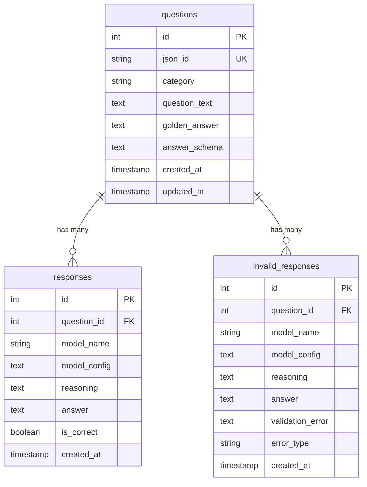

# Database Schema

Dit document beschrijft het complete database schema van de LLM Distiller, inclusief tabellen, relaties, indexes en constraints.

## 📋 Overzicht

Het schema is ontworpen voor:
- **Data integriteit**: ACID compliance en foreign key constraints
- **Performance**: Geoptimaliseerde queries voor grote datasets
- **Flexibiliteit**: Ondersteuning voor diverse vraagtypes en antwoordformaten
- **Traceerbaarheid**: Volledige audit trail van alle bewerkingen

## 🗄️ Tabellen

### 1. `questions` - Vragen Database

```sql
CREATE TABLE questions (
    id INTEGER PRIMARY KEY AUTOINCREMENT,
    json_id TEXT UNIQUE,                    -- Externe identifier
    category TEXT NOT NULL,                  -- Vraag categorie
    question_text TEXT NOT NULL,             -- De vraag zelf
    golden_answer TEXT,                      -- Optioneel referentie antwoord
    answer_schema TEXT,                      -- JSON schema voor validatie
    created_at TIMESTAMP DEFAULT CURRENT_TIMESTAMP,
    updated_at TIMESTAMP DEFAULT CURRENT_TIMESTAMP
);
```

#### Veld Beschrijvingen

| Veld | Type | Constraints | Beschrijving |
|------|------|-------------|--------------|
| `id` | INTEGER | PRIMARY KEY, AUTOINCREMENT | Unieke interne identifier |
| `json_id` | TEXT | UNIQUE, NULLABLE | Externe identifier voor traceerbaarheid |
| `category` | TEXT | NOT NULL | Categorie voor groepering en filtering |
| `question_text` | TEXT | NOT NULL | De daadwerkelijke vraagtekst |
| `golden_answer` | TEXT | NULLABLE | Optioneel correct antwoord als referentie |
| `answer_schema` | TEXT | NULLABLE | JSON schema voor response validatie |
| `created_at` | TIMESTAMP | DEFAULT CURRENT_TIMESTAMP | Aanmaaktijd |
| `updated_at` | TIMESTAMP | DEFAULT CURRENT_TIMESTAMP | Laatste update tijd |

#### Indexes
```sql
-- Performance indexes voor veelgebruikte queries
CREATE INDEX idx_questions_category ON questions(category);
CREATE INDEX idx_questions_json_id ON questions(json_id);
CREATE INDEX idx_questions_created_at ON questions(created_at);
```

### 2. `responses` - Geldige Antwoorden

```sql
CREATE TABLE responses (
    id INTEGER PRIMARY KEY AUTOINCREMENT,
    question_id INTEGER NOT NULL,
    model_name TEXT NOT NULL,               -- LLM model naam
    model_config TEXT NOT NULL,              -- Configuratie als JSON
    reasoning TEXT,                          -- Model reasoning/analysis
    answer TEXT NOT NULL,                    -- Het antwoord zelf
    is_correct NULL,                         -- Handmatige validatie
    created_at TIMESTAMP DEFAULT CURRENT_TIMESTAMP,
    FOREIGN KEY (question_id) REFERENCES questions (id) ON DELETE CASCADE
);
```

#### Veld Beschrijvingen

| Veld | Type | Constraints | Beschrijving |
|------|------|-------------|--------------|
| `id` | INTEGER | PRIMARY KEY, AUTOINCREMENT | Unieke identifier |
| `question_id` | INTEGER | FOREIGN KEY, NOT NULL | Referentie naar vraag |
| `model_name` | TEXT | NOT NULL | Naam van het LLM model |
| `model_config` | TEXT | NOT NULL | Complete configuratie als JSON |
| `reasoning` | TEXT | NULLABLE | Model reasoning proces |
| `answer` | TEXT | NOT NULL | Het gegenereerde antwoord |
| `is_correct` | BOOLEAN | NULLABLE | Handmatige validatie (NULL = niet gevalideerd) |
| `created_at` | TIMESTAMP | DEFAULT CURRENT_TIMESTAMP | Aanmaaktijd |

#### Model Config JSON Structuur
```json
{
    "temperature": 0.7,
    "max_tokens": 1000,
    "top_p": 0.9,
    "frequency_penalty": 0.0,
    "presence_penalty": 0.0,
    "system_prompt": "You are a helpful assistant...",
    "provider": "openai_main",
    "model": "gpt-4"
}
```

#### Indexes
```sql
CREATE INDEX idx_responses_question_id ON responses(question_id);
CREATE INDEX idx_responses_model_name ON responses(model_name);
CREATE INDEX idx_responses_is_correct ON responses(is_correct);
CREATE INDEX idx_responses_created_at ON responses(created_at);
CREATE INDEX idx_responses_question_model ON responses(question_id, model_name);
```

### 3. `invalid_responses` - Ongeldige Antwoorden

```sql
CREATE TABLE invalid_responses (
    id INTEGER PRIMARY KEY AUTOINCREMENT,
    question_id INTEGER NOT NULL,
    model_name TEXT NOT NULL,
    model_config TEXT NOT NULL,
    reasoning TEXT,
    answer TEXT NOT NULL,
    validation_error TEXT NOT NULL,         -- Specifieke foutmelding
    error_type TEXT NOT NULL,               -- Type validatiefout
    created_at TIMESTAMP DEFAULT CURRENT_TIMESTAMP,
    FOREIGN KEY (question_id) REFERENCES questions (id) ON DELETE CASCADE
);
```

#### Veld Beschrijvingen

| Veld | Type | Constraints | Beschrijving |
|------|------|-------------|--------------|
| `id` | INTEGER | PRIMARY KEY, AUTOINCREMENT | Unieke identifier |
| `question_id` | INTEGER | FOREIGN KEY, NOT NULL | Referentie naar vraag |
| `model_name` | TEXT | NOT NULL | Naam van het LLM model |
| `model_config` | TEXT | NOT NULL | Configuratie als JSON |
| `reasoning` | TEXT | NULLABLE | Model reasoning proces |
| `answer` | TEXT | NOT NULL | Het gegenereerde antwoord |
| `validation_error` | TEXT | NOT NULL | Gedetailleerde foutmelding |
| `error_type` | TEXT | NOT NULL | Type validatiefout |
| `created_at` | TIMESTAMP | DEFAULT CURRENT_TIMESTAMP | Aanmaaktijd |

#### Error Types
- `JSON_PARSE_ERROR`: Ongeldige JSON syntax
- `SCHEMA_VALIDATION_ERROR`: Voldoet niet aan JSON schema
- `MISSING_REQUIRED_FIELD`: Verplicht veld ontbreekt
- `INVALID_DATA_TYPE`: Verkeerd data type
- `CONSTRAINT_VIOLATION`: Schema constraint overtreding

#### Indexes
```sql
CREATE INDEX idx_invalid_responses_question_id ON invalid_responses(question_id);
CREATE INDEX idx_invalid_responses_error_type ON invalid_responses(error_type);
CREATE INDEX idx_invalid_responses_created_at ON invalid_responses(created_at);
```

## 🔗 Relaties en Constraints

### Foreign Key Relationships



### Constraints
```sql
-- Unieke constraints voor data integriteit
ALTER TABLE questions ADD CONSTRAINT unique_json_id 
    UNIQUE (json_id) WHERE json_id IS NOT NULL;

-- Check constraints voor data validatie
ALTER TABLE responses ADD CONSTRAINT check_is_correct 
    CHECK (is_correct IS NULL OR is_correct IN (0, 1));

ALTER TABLE invalid_responses ADD CONSTRAINT check_error_type 
    CHECK (error_type IN (
        'JSON_PARSE_ERROR', 
        'SCHEMA_VALIDATION_ERROR', 
        'MISSING_REQUIRED_FIELD', 
        'INVALID_DATA_TYPE', 
        'CONSTRAINT_VIOLATION'
    ));
```

## 📊 Query Patterns

### Veelgebruikte Queries

#### 1. Onverwerkte Vragen Ophalen
```sql
SELECT q.* 
FROM questions q
LEFT JOIN responses r ON q.id = r.question_id
WHERE r.question_id IS NULL
ORDER BY q.created_at ASC
LIMIT 100;
```

#### 2. Response Statistics per Model
```sql
SELECT 
    model_name,
    COUNT(*) as total_responses,
    COUNT(CASE WHEN is_correct = 1 THEN 1 END) as correct_responses,
    COUNT(CASE WHEN is_correct = 0 THEN 1 END) as incorrect_responses,
    COUNT(CASE WHEN is_correct IS NULL THEN 1 END) as unvalidated_responses
FROM responses
GROUP BY model_name;
```

#### 3. Validation Error Analysis
```sql
SELECT 
    error_type,
    COUNT(*) as error_count,
    model_name,
    COUNT(DISTINCT question_id) as affected_questions
FROM invalid_responses
GROUP BY error_type, model_name
ORDER BY error_count DESC;
```

#### 4. Export Dataset voor Fine-tuning
```sql
SELECT 
    q.question_text,
    r.answer,
    q.category,
    r.model_name,
    r.reasoning
FROM questions q
JOIN responses r ON q.id = r.question_id
WHERE r.is_correct = 1
ORDER BY q.created_at ASC;
```

## 🚀 Performance Optimalisatie

### Index Strategie
- **Composite indexes** voor veelgebruikte query combinaties
- **Partial indexes** voor specifieke filters (bv. alleen correcte antwoorden)
- **Covering indexes** om table scans te vermijden

### Query Optimalisatie
```sql
-- Partial index voor alleen correcte antwoorden
CREATE INDEX idx_responses_correct_only ON responses(question_id, created_at)
WHERE is_correct = 1;

-- Composite index voor model performance queries
CREATE INDEX idx_responses_model_stats ON responses(model_name, is_correct, created_at);
```

### Database Maintenance
```sql
-- Periodieke cleanup van oude invalid responses
DELETE FROM invalid_responses 
WHERE created_at < datetime('now', '-30 days');

-- Update statistics voor query optimizer
ANALYZE;
```

## 🔄 Migration Strategie

### Alembic Migrations
```python
# Example migration file
"""Add invalid_responses table

Revision ID: 001_add_invalid_responses
Revises: 
Create Date: 2024-01-01 10:00:00.000000

"""
from alembic import op
import sqlalchemy as sa

def upgrade():
    op.create_table('invalid_responses',
        sa.Column('id', sa.Integer(), nullable=False),
        sa.Column('question_id', sa.Integer(), nullable=False),
        sa.Column('model_name', sa.String(), nullable=False),
        # ... andere kolommen
        sa.ForeignKeyConstraint(['question_id'], ['questions.id'], ondelete='CASCADE'),
        sa.PrimaryKeyConstraint('id')
    )

def downgrade():
    op.drop_table('invalid_responses')
```

### Version Control
- **Semantic versioning** voor schema changes
- **Backward compatibility** waar mogelijk
- **Migration testing** voor data integriteit

## 🔍 Data Quality

### Validation Rules
```sql
-- Trigger voor automatische timestamp updates
CREATE TRIGGER update_questions_timestamp 
    AFTER UPDATE ON questions
    FOR EACH ROW
BEGIN
    UPDATE questions SET updated_at = CURRENT_TIMESTAMP WHERE id = NEW.id;
END;
```

### Data Consistency Checks
```sql
-- Check voor orphaned responses
SELECT COUNT(*) FROM responses r
LEFT JOIN questions q ON r.question_id = q.id
WHERE q.id IS NULL;

-- Check voor duplicate question-model combinations
SELECT question_id, model_name, COUNT(*) as duplicate_count
FROM responses
GROUP BY question_id, model_name
HAVING COUNT(*) > 1;
```

---

*Dit database schema is ontworpen voor maximale flexibiliteit en performance, met duidelijke relaties en constraints die data integriteit garanderen.*