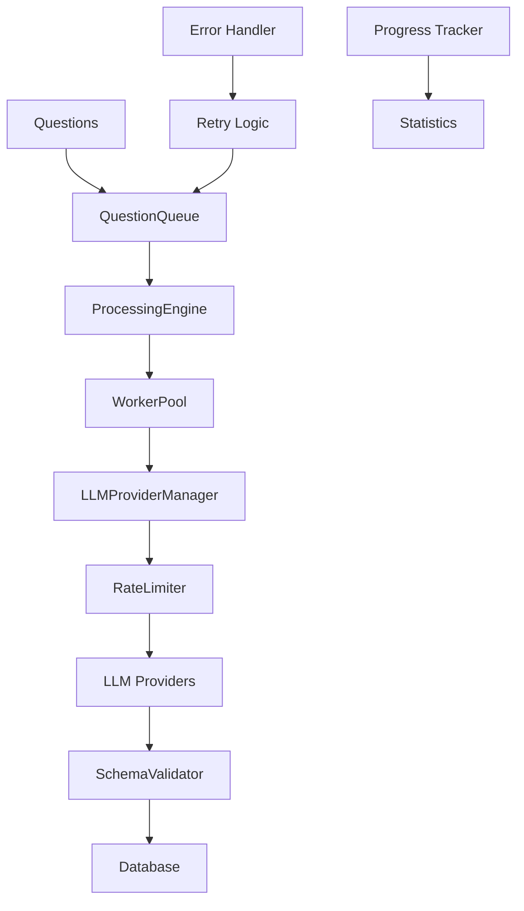

# Processing Engine Implementation

## 🎯 Overview

De processing engine is de kern van LLM Distiller die het volledige vraag-antwoord proces orchestreert. Het systeem is ontworpen voor schaalbaarheid, betrouwbaarheid en flexibiliteit.

## 🏗️ Architecture

### Component Structure
```
src/processing/
├── __init__.py          # Module exports
├── models.py            # Data modellen voor processing
├── queue.py             # Thread-safe task queue
├── manager.py           # LLM provider manager
├── worker.py            # Individual question processor
└── engine.py           # Hoofd orchestrator
```

### Data Flow


## 🔧 Core Components

### ProcessingEngine
De hoofdorchestrator die het hele proces coördineert:

**Responsibilities:**
- Queue management en task distributie
- Worker pool management
- Progress tracking en statistics
- Error handling en recovery
- Timeout management

**Key Methods:**
- `process_questions()` - Hoofd processing methode
- `_load_questions()` - Laad vragen uit database
- `_run_processing()` - Start processing loop
- `_update_stats()` - Update processing statistieken

### QuestionQueue
Thread-safe queue voor task management:

**Features:**
- Async queue operations
- Status tracking (pending, processing, completed, failed)
- Retry mechanism
- Statistics en monitoring

**Key Methods:**
- `add_task()` / `add_tasks()` - Voeg taken toe
- `get_next_task()` - Volgende taak ophalen
- `mark_completed()` - Markeer als voltooid
- `retry_task()` - Probeer taak opnieuw

### LLMProviderManager
Beheert meerdere LLM providers:

**Features:**
- Multi-provider support
- Failover logic
- Load balancing
- Rate limiting integration

**Key Methods:**
- `generate_response_with_failover()` - Genereer met failover
- `get_provider()` - Krijg provider (random of specifiek)
- `add_provider()` / `remove_provider()` - Runtime provider management

### QuestionWorker
Verwerkt individuele vragen:

**Features:**
- LLM aanroepen met rate limiting
- JSON schema validatie
- Response storage (valid/invalid)
- Error handling

**Key Methods:**
- `process_question()` - Verwerk enkele vraag
- `_validate_response()` - Valideer tegen schema
- `_store_valid_response()` / `_store_invalid_response()` - Database storage

## 📊 Data Models

### ProcessingStats
Statistieken voor processing operaties:
```python
@dataclass
class ProcessingStats:
    total_questions: int = 0
    processed_questions: int = 0
    successful_responses: int = 0
    failed_responses: int = 0
    invalid_responses: int = 0
    total_tokens_used: int = 0
    total_cost_cents: int = 0
    processing_time_seconds: float = 0.0
```

### QuestionTask
Task voor het verwerken van een vraag:
```python
@dataclass
class QuestionTask:
    question_id: int
    category: str
    question_text: str
    golden_answer: Optional[str]
    answer_schema: Optional[str]
    provider_name: Optional[str] = None
    retry_count: int = 0
    max_retries: int = 3
    status: ProcessingStatus = ProcessingStatus.PENDING
```

### WorkerResult
Resultaat van worker processing:
```python
@dataclass
class WorkerResult:
    question_id: int
    provider_name: str
    model_name: str
    success: bool
    response_text: Optional[str] = None
    error_message: Optional[str] = None
    error_type: Optional[str] = None
    tokens_used: Optional[int] = None
    processing_time_ms: Optional[int] = None
```

## ⚙️ Configuration

### Processing Settings
```python
class ProcessingConfig(BaseModel):
    batch_size: int = 10                    # Parallelle verwerking
    max_retries: int = 3                     # Maximum pogingen
    timeout_seconds: int = 120                # Request timeout
    validate_responses: bool = True            # Schema validatie
    generation_params: GenerationConfig         # LLM parameters
```

### Rate Limiting
```python
class RateLimitConfig(BaseModel):
    requests_per_minute: int = 60
    requests_per_hour: int = 1000
    tokens_per_minute: int = 40000
    retry_after_seconds: int = 60
```

## 🚀 Usage Examples

### Basic Processing
```python
from src.processing import ProcessingEngine
from src.config import Settings

# Initialize
settings = Settings.load()
engine = ProcessingEngine(db_manager, settings)

# Process questions
result = await engine.process_questions(
    category="math",
    limit=10,
    provider="openai"
)

print(f"Processed {result.stats.processed_questions} questions")
print(f"Success rate: {result.stats.success_rate:.1f}%")
```

### CLI Usage
```bash
# Process 10 questions
python -m src.main process --limit 10

# Process specific category
python -m src.main process --category science --limit 20

# Process with specific provider
python -m src.main process --provider gpt4 --limit 5
```

## 🔍 Error Handling

### Retry Logic
- **Exponential Backoff**: Wachttijd verdubbelt per retry
- **Maximum Retries**: Configureerbaar per vraag
- **Error Classification**: API errors, validation errors, processing errors

### Error Types
- `api_error`: LLM provider API fouten
- `rate_limit_error`: Rate limit exceeded
- `schema_validation`: Response voldoet niet aan schema
- `processing_error`: Onverwachte processing fouten

### Recovery Strategies
- **Provider Failover**: Poging met alternatieve provider
- **Queue Retry**: Terugplaatsen in queue voor later
- **Dead Letter Queue**: Permanent gefaalde taken

## 📈 Performance Features

### Parallel Processing
- **Worker Pool**: Meerdere workers draaien parallel
- **Configurable Batch Size**: Aangepast aan API limits
- **Async Operations**: Non-blocking I/O throughout

### Rate Limiting
- **Per-Provider Limits**: Respecteert API constraints
- **Adaptive Throttling**: Past zich aan aan API feedback
- **Token-based Limits**: Voorkomt token quota overschrijding

### Memory Management
- **Streaming Processing**: Grote datasets in chunks
- **Connection Pooling**: Hergebruikt database connecties
- **Garbage Collection**: Opruimen van completed tasks

## 🔧 Integration Points

### Database Integration
- **Session Management**: Async context managers
- **Transaction Safety**: Rollback bij fouten
- **Connection Pooling**: Efficiënt database gebruik

### LLM Provider Integration
- **Standardized Interface**: `BaseLLMProvider` abstractie
- **Response Parsing**: Genormaliseerde response format
- **Metadata Tracking**: Tokens, timing, cost

### Validation Integration
- **JSON Schema**: Strikte response validatie
- **Quality Assessment**: Coherentie en compleetheid checks
- **Error Reporting**: Gedetailleerde validation errors

## 📊 Monitoring & Statistics

### Real-time Metrics
- Processing speed (questions/second)
- Success/failure rates
- Token usage statistics
- Cost tracking

### Progress Reporting
- Queue status (pending, processing, completed)
- Worker utilization
- Error rates per provider
- Retry statistics

### Performance Analytics
- Average response time per provider
- Token efficiency metrics
- Cost per successful response
- Validation success rates

---

Deze processing engine vormt het hart van LLM Distiller en zorgt voor efficiënte, betrouwbare verwerking van vragen met volledige monitoring en error handling.